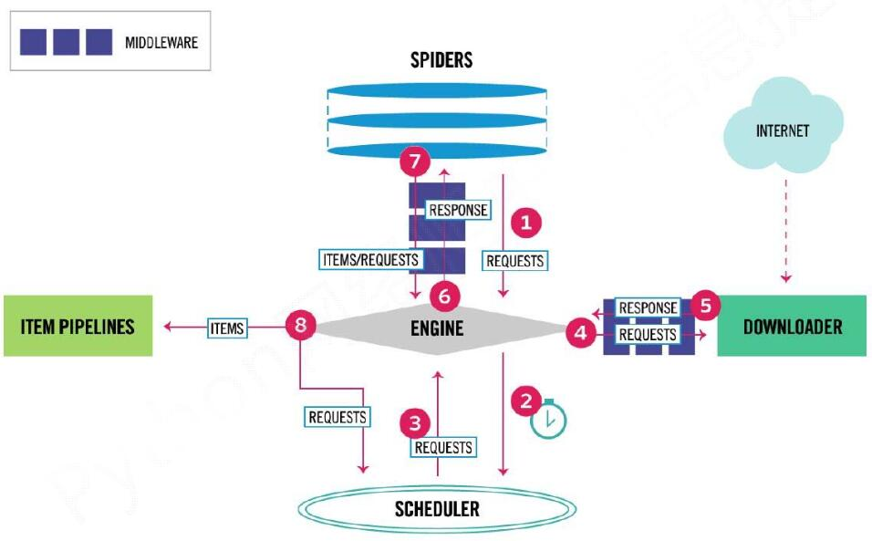

# Scrapy爬虫框架

Scrapy是一个支持高并发的网络爬虫框架

## 框架结构 - 5+2结构

5个模块
- Spiders 
    - 框架入口，提供初始的爬取请求，用户编写（配置）
    - 解析Downloader返回的响应
    - 产生爬取项
    - 产生额外的爬取请求
- Engine 
    - 已有实现
    - 控制各模块之间的数据流
    - 根据条件触发事件
    - 不间断从Scheduler处获得爬取请求，直至请求为空
- Scheduler 
    - 已有实现
    - 对所有爬虫请求进行调度管理
- Downloader 
    - 已有实现
    - 根据请求下载页面
- Item pipelines 
    - 框架出口，用户编写（配置）
    - 以流水线方式处理Spider产生的爬取项
    - 由一组操作顺序组成，类似流水线，每个操作是一个Item Pipeline类型
    - 清理、检验和查重爬取项中的HTML数据，将数据存储到数据库

2个中间件
- Spiders和Engine之间
    - 对请求和爬取项的再处理
    - 修改、丢弃、新增请求或爬取项
    - 用户可以编写配置代码
- Downloader和Engine之间
    - 实施Engine、Scheduler和Downloader之间进行用户可配置的控制
    - 修改、丢弃、新增请求或响应
    - 用户可以编写配置代码



## 数据流的三条路径

- 第一条路径
    - Engine从Spiders处获得爬取请求(Request)
    - Engine将爬取请求转发给Scheduler，用于调度
- 第二条路径
    - Engine从Scheduler处获得下一个要爬取的请求
    - Engine将爬取请求通过中间件发送给Downloader
    - 爬取网页后，Downloader形成响应(Response)，通过中间件发给Engine
    - Engine将收到的响应通过中间件发送给Spider处理
- 第三条路径
    - Spider处理响应后产生爬取项(Scraped Item)和新的爬取请求给Engine
    - Engine将爬取项发送给Item Pipeline
    - Engine将爬取请求发送给Scheduler

## 与requests库的比较

相同点
- 都可以进行对页面的请求和爬取，是Python爬虫的两条常用技术路线
- 都没有处理js、提交表单、应对验证码等功能（可扩展）

不同点

| requests | Scrapy |
| --- | --- |
| 功能库 | 框架 |
| 页面级爬虫 | 网站级爬虫 |
| 重点在于页面下载 | 重点在于爬虫结构 |
| 并发考虑不足，性能较差 | 并发较好，性能较高 |
| 定制灵活 | 一般定制灵活，深度定制困难 |

## Scrapy命令

```
# 基本格式
> scrapy <command> [options] [args]

# 常用命令
# Create new project
> scrapy startproject <name> [dir]

# Generate new spider using pre-defined templates
> scrapy genspider [options] <name> [domain]

# Run a self-contained spider (without creating a project)
> scrapy runspider <name>
```
